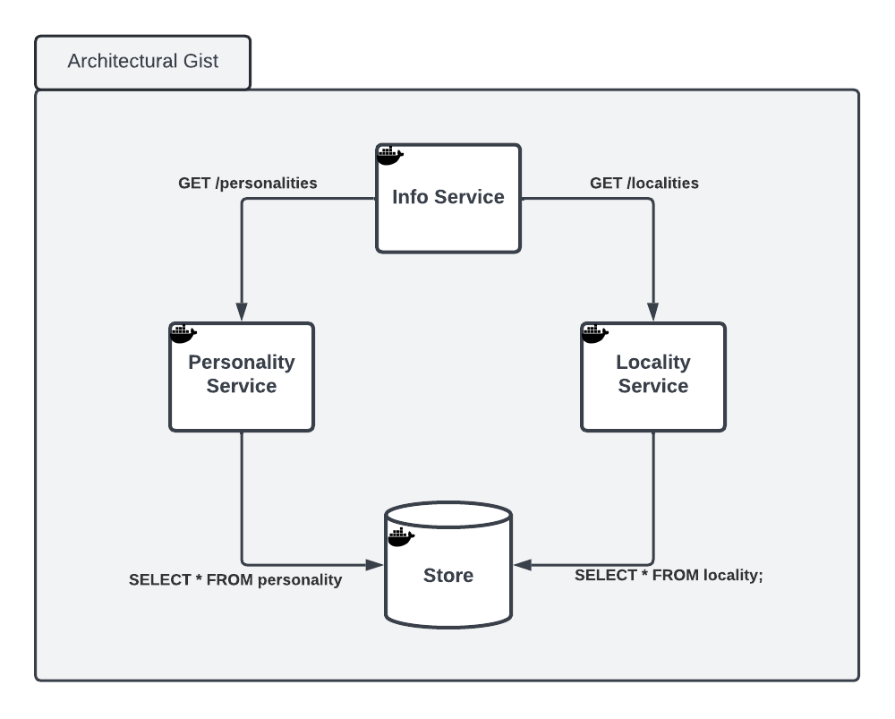

# quarkus poc
This is a sample app intended to serve the purpose of demonstrating Quarkus microservices.



## prep

### install prerequisites
```
% arch -arm64 brew install quarkusio/tap/quarkus
# graalvm installation for Mac
% brew install --cask graalvm/tap/graalvm-ce-java11
% export JAVA_HOME=/Library/Java/JavaVirtualMachines/graalvm-ce-java11-22.2.0/Contents/Home/
% export PATH=/Library/Java/JavaVirtualMachines/graalvm-ce-java11-22.2.0/Contents/Home/bin:"$PATH"
% gu install native-image
```

### learning about quarkus-maven-plugin
```
% mvn help:describe -e -Dplugin=io.quarkus.platform:quarkus-maven-plugin
```

### package, build, and run an initial container image...
```
% ./mvnw clean package -Pnative
% docker build --force-rm -f src/main/docker/Dockerfile.jvm -t quarkus/personality .
```

### start a database (postgres) container then run the app container
```
% docker run --rm -p 5432:5432 \
  -e POSTGRES_USER=beaker \
  -e POSTGRES_PASSWORD=meep \
  -e POSTGRES_DB=appdb \
  postgres
% docker run --rm -p 9080:9080 \
  -e quarkus.datasource.username=beaker \
  -e quarkus.datasource.password=meep \
  -e quarkus.datasource.jdbc.url=jdbc:postgresql://host.docker.internal/appdb \
  quarkus/personality
```

Navigate to http://localhost:9080 to see the user interface or http://localhost:9080/personalities to view a json payload of all personalities.

### ... or run in dev mode
> i.e. to run locally in dev mode execute the following from the personality directory.
```
./mvnw compile quarkus:dev -Ddebug=$DEBUG_PORT
```

Repeat this :point_up: for the info and locality services if desired.

